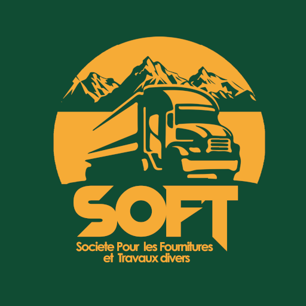

This app handles the management of the operations of a local enterprise called Soft. 
If you want to find inspiration from it (like particular uses of specific widgets, secure ways to interact with an API, ...), feel free to clone it.
The english language is used on documentation(since it is the lingua franca for developers), but the app itself is in French.

# Behind the scenes
This app is connected to a REST api i wrote in python.
The code for the REST api is public and free to use (check my repo <a href="https://github.com/jspmic/rest-api">rest-api</a>).

# Future plans
- Beautify this README file
- Add screenshots of the final app before the 1st december
